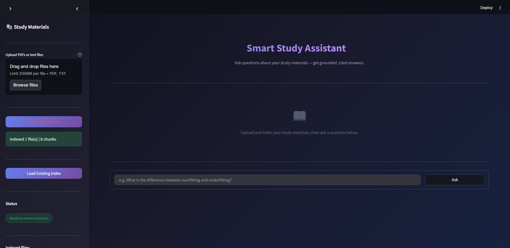
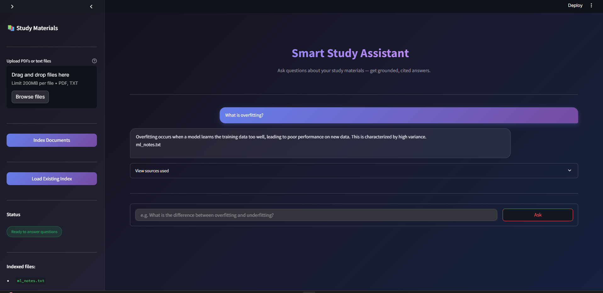

# 📚 RAG Study Assistant

A simple **Retrieval-Augmented Generation (RAG)** web app that lets you upload documents (PDFs) and ask questions about them. The system retrieves relevant content and generates accurate, context-aware answers.

---

## 🚀 Features

* 📄 Upload PDF documents
* 🔍 Semantic search over document content
* 🤖 AI-powered question answering
* 📚 Source highlighting (see where answers come from)
* 🌐 Simple web interface using Streamlit

---

## 🧠 Architecture

This project follows a standard **RAG pipeline**:

```
                ┌────────────────────┐
                │   PDF Document     │
                └─────────┬──────────┘
                          │
                          ▼
                ┌────────────────────┐
                │   Text Chunking    │
                └─────────┬──────────┘
                          │
                          ▼
                ┌────────────────────┐
                │   Embeddings       │
                └─────────┬──────────┘
                          │
                          ▼
                ┌────────────────────┐
                │  Vector Database   │
                │     (FAISS)        │
                └─────────┬──────────┘
                          │
        User Query        │
            │             ▼
            ▼   ┌────────────────────┐
        ┌────────▶ Retrieval (Top-K) │
        │       └─────────┬──────────┘
        │                 │
        │                 ▼
        │       ┌────────────────────┐
        └──────▶│   LLM Generation   │
                └─────────┬──────────┘
                          ▼
                   💡 Final Answer
```

---

## ⚙️ Tech Stack

* Frontend: Streamlit
* LLM + Embeddings: OpenAI
* Framework: LangChain
* Vector Database: FAISS

---

## 📂 Project Structure

```
rag-study-assistant/
│── app.py              # Streamlit app
│── requirements.txt   # Dependencies
│── .env  
│── README.md          # Project documentation

```
## 📸 Screenshots

### Upload Document


### Ask a Question


---

## 🛠️ Installation

### 1. Clone the repository

```bash
git clone https://github.com/your-username/rag-study-assistant.git
cd rag-study-assistant
```

---

### 2. Install dependencies

```bash
pip install -r requirements.txt
```

---

### 3. Set environment variables

```bash
export OPENAI_API_KEY="your_api_key_here"
```

(Windows PowerShell)

```bash
setx OPENAI_API_KEY "your_api_key_here"
```

---

## ▶️ Usage

Run the app:

```bash
streamlit run app.py
```

Then:

1. Upload a PDF 📄
2. Ask a question ❓
3. Get an AI-generated answer 💡
4. View source chunks 📚

---

## 🔍 How It Works

### 1. Text Chunking

Documents are split into smaller overlapping chunks to preserve context and improve retrieval accuracy.

### 2. Embedding Creation

Each chunk is converted into a vector representation (embedding) capturing its semantic meaning.

### 3. Vector Storage

Embeddings are stored in a FAISS vector database for efficient similarity search.

### 4. Retrieval (Top-K)

When a user asks a question:

* The query is embedded
* The system retrieves the **top K most relevant chunks**

### 5. Answer Generation

The retrieved context is passed to the LLM, which generates a grounded answer.

---

## 📚 Learning Goals

This project demonstrates:

* Understanding of RAG pipelines
* Semantic search using embeddings
* Integration of LLMs into applications
* Building simple AI-powered web apps

---
